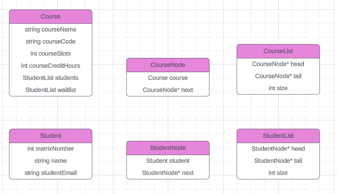

## MECS0023 DSA - MINI PROJECT SPECIFICATION

# Student Course Management System

### INTRODUCTION

#### Synopsis Project

The project aims to develop a text-based application in C++ that manages course and student registrations using various data structures.

#### Objective of the project

The objective is to implement a system that efficiently handles student enrollments and course registrations, while utilizing fundamental data structures such as linked lists and queues.

### SYSTEM ANALYSIS AND DESIGN (USE CASE, FLOWCHART AND CLASS DIAGRAM)

#### System Requirements

The system must allow users to:

1. Register a student.
2. Register a course (with a limited number of slots).
3. Enroll a student in a course (if slots are available, otherwise add to a waiting list).
4. De-enroll a student (if there are students on the waiting list, enroll the first student in the queue).
5. Display available courses.
6. Display registered students.

#### System Design

The system will be menu-driven, offering options for each functionality mentioned above.

The class diagram represents the structure of the system in terms of classes, their attributes, methods, and relationships. It illustrates how different entities such as students, courses, and registrations are modeled in the system.

### UML Diagram

### SYSTEM PROTOTYPE

A prototype will be developed to demonstrate the core functionalities of the system.

